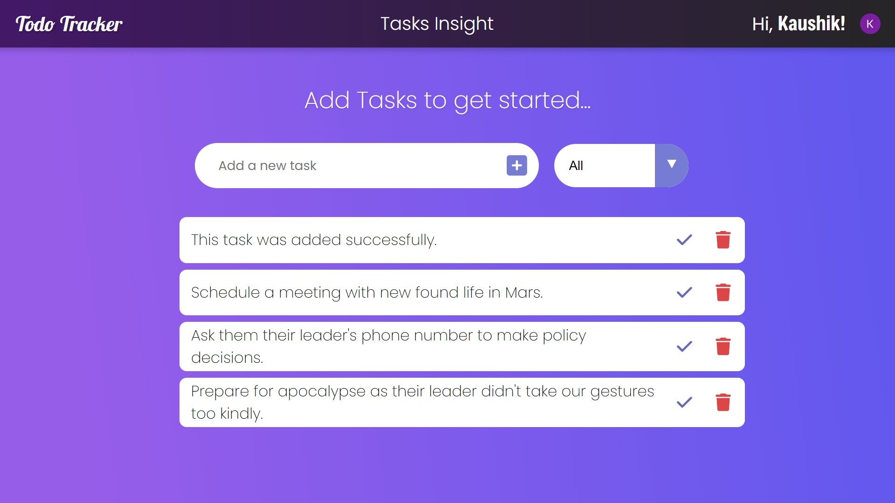

# Todo Tracker App

- Built a full-stack **Todo Tracker App** using **React** and **Spring Boot** for managing daily tasks efficiently. Implemented a secure and authenticated **SSO login** system with **Clerk**, supporting sign-ups via **Google**, **Microsoft**, **Facebook**, and other email verification for seamless user experience.

## Features

- Create new user accounts (With SSO login)
- Manage user accounts
- Create and manage todos
- Mark tasks as completed
- Delete completed tasks
- Filter tasks based on status (all, completed, uncompleted)

## Frontend

The front-end is built with **React**, providing an intuitive and dynamic interface for managing tasks. It interacts with the backend API using **fetch** for secure data transmission.

### Key Technologies

- HTML
- CSS
- JavaScript
- React
- fetch API

### Components (Parts used)

- **SignIn**: Form for Signing into existing account.
- **SignUp**: Form to Sign-up for a new account.
- **Dashboard**: Central place to manage user account & their tasks easily.
- **TodoForm**: Form for adding new tasks.
- **TodoForm**: Form for adding new tasks.
- **TodoFilter**: Dropdown filter to view all, completed, or uncompleted tasks.
- **TodoList**: Displays the list of todos, allows users to mark them as completed or delete them.

## Backend

The back-end is built with **Spring Boot**. It exposes **RESTful APIs** to manage todos. The app integrates **MySQL** for persistent data storage, ensuring that todos are tracked across user sessions.

### Key Technologies

- Spring Boot
- Spring Data JPA
- Spring MySQL Driver 
- Spring Lombok
- MySQL Database

## Contributing

Contributions are currently closed at the moment! 